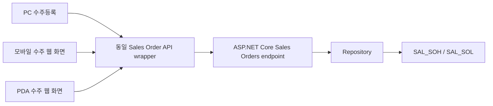
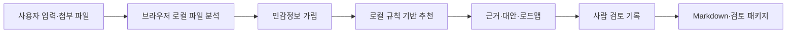
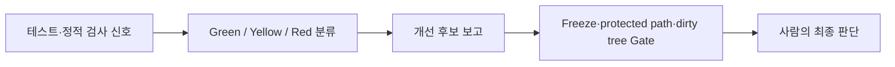

# 최종 아키텍처·데이터 흐름 감사

## 수주 PC·모바일·PDA

- 세 화면은 독립 데이터 복사본이 아니라 같은 수주 API wrapper와 backend endpoint를 사용한다.
- Mock은 브라우저 내 mock data service, InMemory는 API repository, SQL Server는 로컬 테스트 DB repository로 실행된다.
- SQL Server 교차 검증은 로컬 `G2ERP_DEV_LOCAL_TEST`만 사용했으며 직접 DML은 하지 않았다.

## AI 솔루션 센터

- 외부 LLM, 외부 파일 저장소, 고객 시스템 API를 호출하지 않는다.
- 지원하지 않는 파일은 메타정보·사용자 메모 범위로 제한하고 실행 파일은 차단한다.
- 패키지는 strict schema와 민감정보·위험 top-level field 방어를 거친다.

## 자동 유지보수

- ANALYZE는 관찰·보고용이다.
- `finalDecisionSetByAi`는 false이며 AI가 커밋·배포·최종 적용을 하지 않는다.
- artifact는 git ignore 대상이다.
